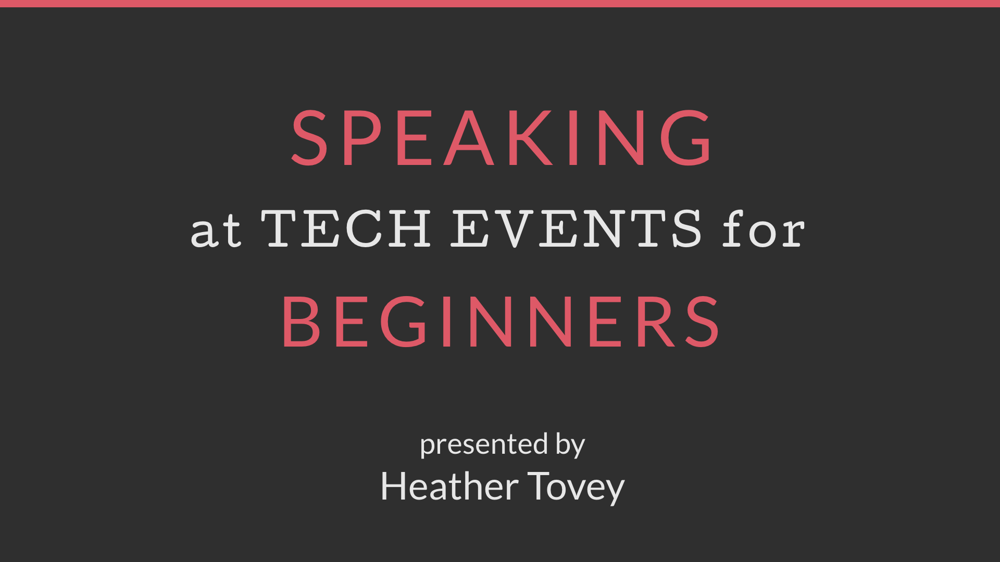
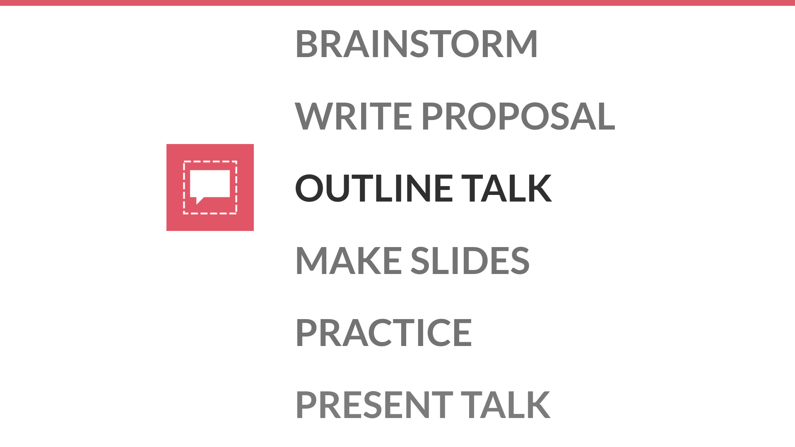
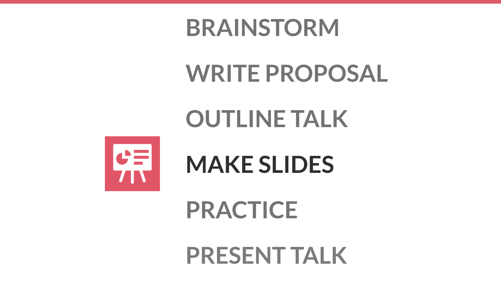
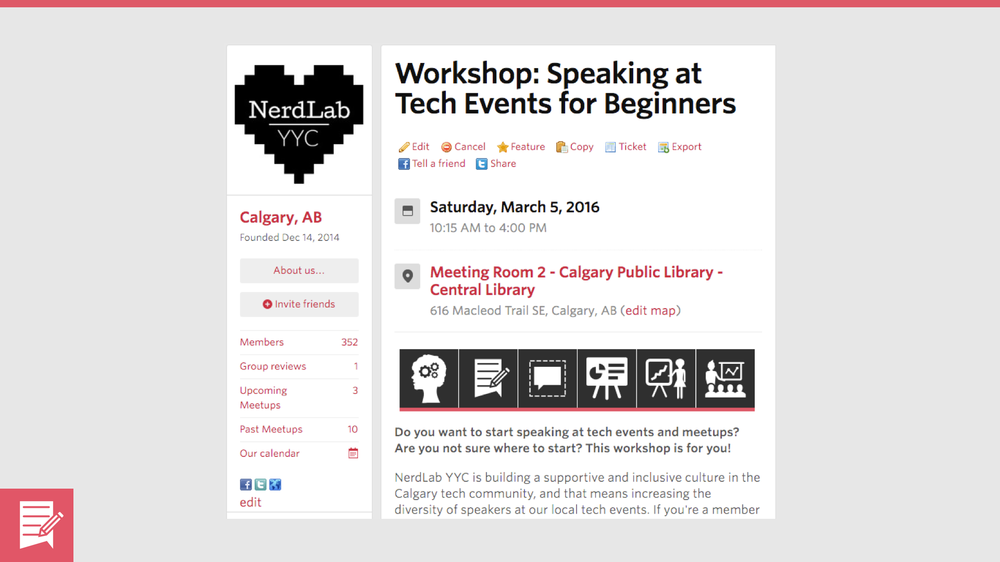
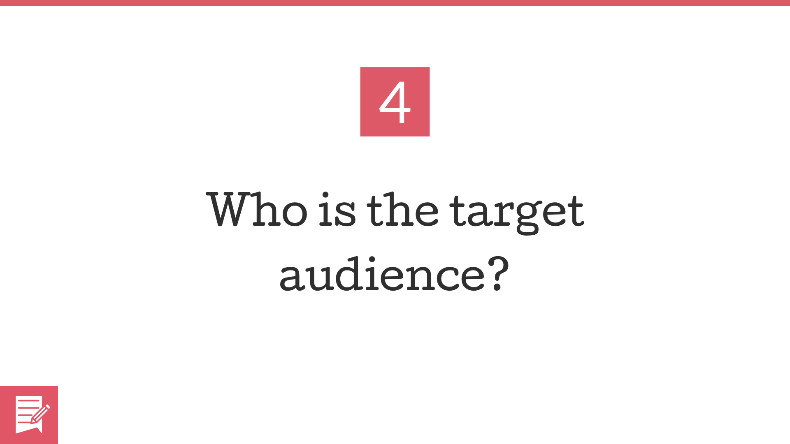
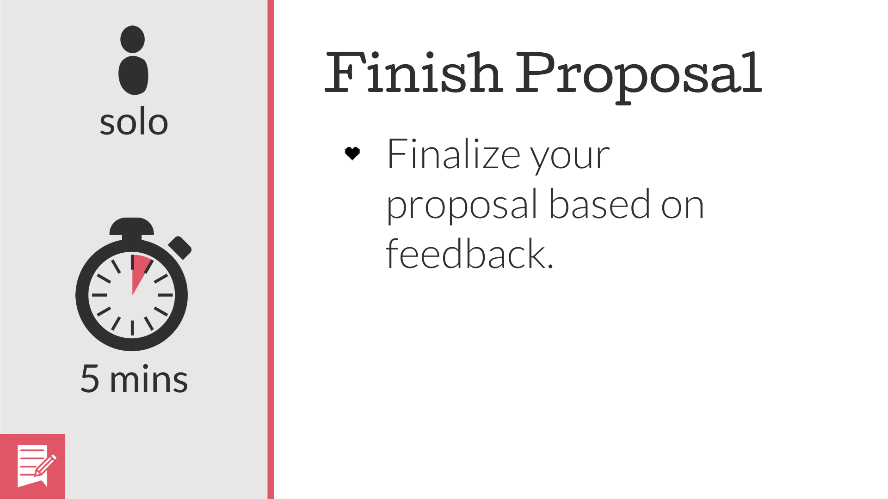
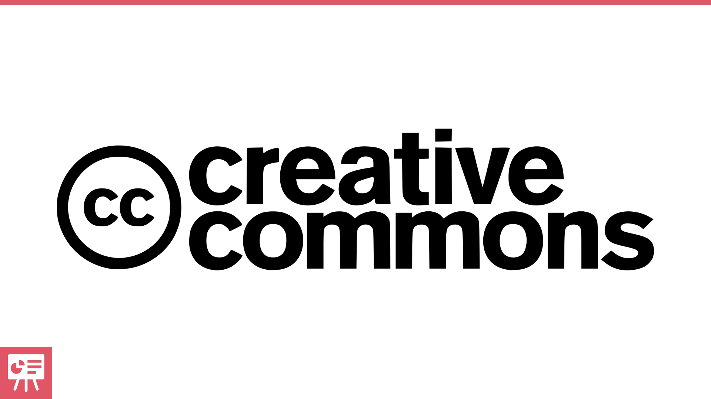

I recently gave a Speaking at Tech Events for Beginners workshop. Here, you'll find the slides with my notes, and some resources for continuing on with public speaking. You can also download the [accompanying worksheets](../assets/general-worksheets.pdf).

##Table of Contents

1. [Slides with Notes](#slides-with-notes)
2. [Attribution](#attribution)
3. [Resources](#resources)
4. [Local Speaking Opportunities](#local-speaking-opportunities)

## Slides with Notes
<figure class="figure-grid">
	

		
	
<!--
  --><figcaption class="grid--one-half figure-caption">Welcome to NerdLab YYC's first workshop, Speaking at Tech Events for Beginners.</figcaption>
</figure>
<figure class="figure-grid">
	

		
	
<!--
  --><figcaption class="grid--one-half figure-caption">Today, you're here to learn how to speak at tech events.</figcaption>
</figure>
<figure class="figure-grid">
	

		
	
<!--
  --><figcaption class="grid--one-half figure-caption">And I'm here to help. My name is Heather Tovey, and I'm a co-founder of NerdLab YYC.</figcaption>
</figure>
<figure class="figure-grid">
	

		
	
<!--
  --><figcaption class="grid--one-half figure-caption">I've given a few talks for Calgary's tech community, including a talk on learning how to code as well as a workshop on defeating impostor syndrome.</figcaption>
</figure>
<figure class="figure-grid">
	

		
	
<!--
  --><figcaption class="grid--one-half figure-caption">I'm also a frequent conference attendee. I love hearing from diverse perspectives, and I'm excited to get more beginners speaking at tech events.</figcaption>
</figure>
<figure class="figure-grid">
	

		
	
<!--
  --><figcaption class="grid--one-half figure-caption">So let's talk about today's workshop.</figcaption>
</figure>
<figure class="figure-grid">
	

		
	
<!--
  --><figcaption class="grid--one-half figure-caption">Today, you'll create and present a lightning talk.</figcaption>
</figure>
<figure class="figure-grid">
	

		
	
<!--
  --><figcaption class="grid--one-half figure-caption">For today's workshop, a lightning talk is 3 minutes long.</figcaption>
</figure>
<figure class="figure-grid">
	

		
	
<!--
  --><figcaption class="grid--one-half figure-caption">You'll learn how to brainstorm for ideas,</figcaption>
</figure>
<figure class="figure-grid">
	

		
	
<!--
  --><figcaption class="grid--one-half figure-caption">write a talk proposal,</figcaption>
</figure>
<figure class="figure-grid">
	

		
	
<!--
  --><figcaption class="grid--one-half figure-caption">outline your talk,</figcaption>
</figure>
<figure class="figure-grid">
	

		
	
<!--
  --><figcaption class="grid--one-half figure-caption">make slides,</figcaption>
</figure>
<figure class="figure-grid">
	

		
	
<!--
  --><figcaption class="grid--one-half figure-caption">practice your talk,</figcaption>
</figure>
<figure class="figure-grid">
	

		
	
<!--
  --><figcaption class="grid--one-half figure-caption">and then, at the end of the day, you'll present your talk to the rest of the group.</figcaption>
</figure>
<figure class="figure-grid">
	

		
	
<!--
  --><figcaption class="grid--one-half figure-caption">A few notes! First, today's activities are time-sensitive. Keep your eye on the clock so that you can finish up each activity.</figcaption>
</figure>
<figure class="figure-grid">
	

		
	
<!--
  --><figcaption class="grid--one-half figure-caption">Also, this workshop is collaborative. You will be working in groups.</figcaption>
</figure>
<figure class="figure-grid">
	

		
	
<!--
  --><figcaption class="grid--one-half figure-caption">It's also beginner-friendly. This is a safe space for you to make mistakes, ask questions, and learn.</figcaption>
</figure>
<figure class="figure-grid">
	

		
	
<!--
  --><figcaption class="grid--one-half figure-caption">With that in mind, it's important to note that NerdLab YYC does have a Code of Conduct. We're dedicated to providing a harassment free experience for everyone. See the detailed version of our <a href="http://nerdlabyyc.com/code-of-conduct">Code of Conduct</a> for more details.</figcaption>
</figure>
<figure class="figure-grid">
	

		
	
<!--
  --><figcaption class="grid--one-half figure-caption">In addition to our Code of Conduct, we have one very important guideline for today, and that is to be constructive and helpful.</figcaption>
</figure>
<figure class="figure-grid">
	

		
	
<!--
  --><figcaption class="grid--one-half figure-caption">During your group sessions, you will be providing suggestions and feedback, and it's important to keep that feedback constructive.</figcaption>
</figure>
<figure class="figure-grid">
	

		
	
<!--
  --><figcaption class="grid--one-half figure-caption">Try to frame your feedback within these 3 points. You can tell the other person what they did, the impact of what they did, and how they can improve.</figcaption>
</figure>
<figure class="figure-grid">
	

		
	
<!--
  --><figcaption class="grid--one-half figure-caption">For example, I could say, "You spoke very fast. People might miss something. Try slowing down and adding pauses."</figcaption>
</figure>
<figure class="figure-grid">
	

		
	
<!--
  --><figcaption class="grid--one-half figure-caption">What we don't want today is destructive feedback. Your proposal is awful, your slides are ugly, your talk is boring.</figcaption>
</figure>
<figure class="figure-grid">
	

		
	
<!--
  --><figcaption class="grid--one-half figure-caption">This isn't helpful, and it's just mean, so don't do this.</figcaption>
</figure>
<figure class="figure-grid">
	

		
	
<!--
  --><figcaption class="grid--one-half figure-caption">If there are any issues today, please come talk to me about it. Or you can email me at heather@htovey.com or email NerdLab YYC at nerdlabyyc@gmail.com. We'll try to take care of issues as quickly as possible.</figcaption>
</figure>
<figure class="figure-grid">
	

		
	
<!--
  --><figcaption class="grid--one-half figure-caption">Okay, so now, you should already be in the groups you're going to be working in today.</figcaption>
</figure>
<figure class="figure-grid">
	

		
	
<!--
  --><figcaption class="grid--one-half figure-caption">I'd also like to make sure that each one of you has a set of worksheets. We will be using these worksheets during our activities today, so it's important that you have one.</figcaption>
</figure>
<figure class="figure-grid">
	

		
	
<!--
  --><figcaption class="grid--one-half figure-caption">Alright, so let's move on to our first activity of the day. Introductions. It's time to get to know the group members that you're going to be working with today. I'd like for you to take 5 minutes and go around the group. Each group member should introduce themselves, say who they are, and why they're here. And on page 2, you can take notes, as needed.</figcaption>
</figure>
<figure class="figure-grid">
	

		
	
<!--
  --><figcaption class="grid--one-half figure-caption">Now that you've gotten the chance to get to know your group members, it's time to setup tech for the day. Please turn to page 3 of your worksheets. There, you'll find instructions to go through. We'll be using Google Drive to share and collaborate today, and you'll find a link to your group's Google Drive on pg. 3. Please go ahead and open up your presentation software of choice. If it's not one of the ones listed on the worksheet, please let me know.</figcaption>
</figure>
<figure class="figure-grid">
	

		
	
<!--
  --><figcaption class="grid--one-half figure-caption">Okay, let's talk about Brainstorming! Brainstorming can be difficult.</figcaption>
</figure>
<figure class="figure-grid">
	

		
	
<!--
  --><figcaption class="grid--one-half figure-caption">A common refrain I hear is "Oh, well I'm not an expert. What would I possibly talk about?" But people tend to overthink how much they need to know about a topic before they can talk about it.</figcaption>
</figure>
<figure class="figure-grid">
	

		
	
<!--
  --><figcaption class="grid--one-half figure-caption">What you think you need to know may be an entire world of information around a topic. But in reality, conference talks just aren't long enough to say everything there is to say about a subject.</figcaption>
</figure>
<figure class="figure-grid">
	

		
	
<!--
  --><figcaption class="grid--one-half figure-caption">What you actually need to know are the points you want to make and maybe a few closely related items. It's okay if you don't know everything vaguely related to your topic, and it's okay if you don't know how to answer every question. Most speakers don't know everything about their topic.</figcaption>
</figure>
<figure class="figure-grid">
	

		
	
<!--
  --><figcaption class="grid--one-half figure-caption">It's also important to note that experts aren't always the best for the job.</figcaption>
</figure>
<figure class="figure-grid">
	

		
	
<!--
  --><figcaption class="grid--one-half figure-caption">Experts know a lot. They're all the way over here.</figcaption>
</figure>
<figure class="figure-grid">
	

		
	
<!--
  --><figcaption class="grid--one-half figure-caption">But many conference talks are made with the beginner in mind. Introductions, how-tos, tips and tricks.</figcaption>
</figure>
<figure class="figure-grid">
	

		
	
<!--
  --><figcaption class="grid--one-half figure-caption">The problem is that while experts may have the knowledge to give these types of talks, they've forgotten what it's like to be a beginner, and they've forgotten what they struggled with. They may find it difficult to communicate information to their audience without overwhelming beginners.</figcaption>
</figure>
<figure class="figure-grid">
	

		
	
<!--
  --><figcaption class="grid--one-half figure-caption">The people in the middle, with intermediate knowledge and skills, are the best for this kind of job. They have enough knowledge to share, and they still remember what it's like to be a beginner. They're more able to communicate without overwhelming their audience.</figcaption>
</figure>
<figure class="figure-grid">
	

		
	
<!--
  --><figcaption class="grid--one-half figure-caption">So basically, you definitely know enough to give a talk.</figcaption>
</figure>
<figure class="figure-grid">
	

		
	
<!--
  --><figcaption class="grid--one-half figure-caption">So now that you're maybe more motivated to brainstorm some talk ideas, let's talk about the types of topics you see at tech conferences and events.</figcaption>
</figure>
<figure class="figure-grid">
	

		
	
<!--
  --><figcaption class="grid--one-half figure-caption">There's the Development topic. These talks tend to cover topics like programming languages and frameworks.</figcaption>
</figure>
<figure class="figure-grid">
	

		
	
<!--
  --><figcaption class="grid--one-half figure-caption">An example of this would be "<a href="https://2015.calgary.wordcamp.org/session/double-feature-ssl-and-git-basics/">Double Feature: SSL Introduction & Git Basics for Developers & Designers</a>" by <a href="http://asolidsite.com/">Mike Tighe</a>.</figcaption>
</figure>
<figure class="figure-grid">
	

		
	
<!--
  --><figcaption class="grid--one-half figure-caption">There's also the Design topic. These talks tend to cover things like design tools (like Photoshop and Sketch), User Experience, and even traditional art.</figcaption>
</figure>
<figure class="figure-grid">
	

		
	
<!--
  --><figcaption class="grid--one-half figure-caption">An example of this would be "Kickstarting Your Sketching and Visual Thinking Skills" by <a href="http://www.sketchnotesbook.com/">Eva-Lotta Lamm</a>.</figcaption>
</figure>
<figure class="figure-grid">
	

		
	
<!--
  --><figcaption class="grid--one-half figure-caption">Then, you have the Business topic. These talks tend to cover topics like Customer Needs and SEO.</figcaption>
</figure>
<figure class="figure-grid">
	

		
	
<!--
  --><figcaption class="grid--one-half figure-caption">An example of the Business topic would be "The ABCs of Analytics" by <a href="https://twitter.com/andrewjwright">Andrew Wright</a>.</figcaption>
</figure>
<figure class="figure-grid">
	

		
	
<!--
  --><figcaption class="grid--one-half figure-caption">Next, we have the Personal Development topic. These talks tend to help people in their careers and personal lives and include topics like career-building strategies and finding creative expression.</figcaption>
</figure>
<figure class="figure-grid">
	

		
	
<!--
  --><figcaption class="grid--one-half figure-caption">An example of this type of topic would be "Anatomy of a Job Search" by <a href="http://juliepagano.com/speaking/">Julie Pagano</a>.</figcaption>
</figure>
<figure class="figure-grid">
	

		
	
<!--
  --><figcaption class="grid--one-half figure-caption">So those are the types of topics you may see at a tech event, but where do you find inspiration?</figcaption>
</figure>
<figure class="figure-grid">
	

		
	
<!--
  --><figcaption class="grid--one-half figure-caption">Think about what you work on a lot. What do you do at work or what do you study at school?</figcaption>
</figure>
<figure class="figure-grid">
	

		
	
<!--
  --><figcaption class="grid--one-half figure-caption">Think about what you work on sometimes. Are you involved in any open source work or side projects?</figcaption>
</figure>
<figure class="figure-grid">
	

		
	
<!--
  --><figcaption class="grid--one-half figure-caption">Think about what topics excite you. What are you passionate about?</figcaption>
</figure>
<figure class="figure-grid">
	

		
	
<!--
  --><figcaption class="grid--one-half figure-caption">And think about what you wish more people would talk about. Are there any questions you had as a beginner that you wish more people had answered?</figcaption>
</figure>
<figure class="figure-grid">
	

		
	
<!--
  --><figcaption class="grid--one-half figure-caption">Now, it's your turn to do some brainstorming. Turn to page 4 in your worksheets, and take the next 5 minutes to fill out the brainstorming worksheet on your own. During your 5 minutes, write down as many topic ideas as you can think of as quickly as you can. Don't worry about whether or not ideas or good or bad or whether or not you have enough material to give a talk. Just dump everything in your brain onto paper. You'll have time to choose one of the topics later.</figcaption>
</figure>
<figure class="figure-grid">
	

		
	
<!--
  --><figcaption class="grid--one-half figure-caption">Now that you've had some time to brainstorm ideas, it's time to get group feedback. Take about 5 minutes each to share your ideas with your group. During your 5 minutes, go over your ideas and note which ones are your favorites. Then, your group should give you constructive feedback, ask any questions they have, and maybe even help you to generate new ideas. Our Timekeeper will let you know when it's time to switch to a new group member.</figcaption>
</figure>
<figure class="figure-grid">
	

		
	
<!--
  --><figcaption class="grid--one-half figure-caption">Okay, now that you've received some feedback on your idea, I'd like for you to take the next 5 minutes and select the topic that you're going to use for the rest of the day. Remember that your talk today will be 3 minutes long, so be sure to choose a topic that you can discuss within that period of time.</figcaption>
</figure>
<figure class="figure-grid">
	

		
	
<!--
  --><figcaption class="grid--one-half figure-caption">Okay, now that you've chosen a topic idea, it's time to start writing a talk proposal.</figcaption>
</figure>
<figure class="figure-grid">
	

		
	
<!--
  --><figcaption class="grid--one-half figure-caption">A talk proposal is generally made up of a title and a description.</figcaption>
</figure>
<figure class="figure-grid">
	

		
	
<!--
  --><figcaption class="grid--one-half figure-caption">Many conferences use a CFP (or Call for Proposals), and ask people who want to speak at their event to submit a talk proposal. The conference organizers then use these talk proposals to decide who gets to talk at their event. So a good talk proposal can your talk selected for an event.</figcaption>
</figure>
<figure class="figure-grid">
	

		
	
<!--
  --><figcaption class="grid--one-half figure-caption">A talk proposal can also encourage people to attend your event. Here's the proposal that we put on Meetup for this workshop.</figcaption>
</figure>
<figure class="figure-grid">
	

		
	
<!--
  --><figcaption class="grid--one-half figure-caption">A talk proposal can also encourage people to attend your talk over someone else's talk in the same time slot. For example, I chose to attend <a href="http://lindseywiebe.com/">Lindsey Wiebe's</a> talk on <a href="https://2015.calgary.wordcamp.org/files/2015/05/User-Centric-Site-Improvement-WordCamp-YYC-2015.pdf">User-Centric Site Improvement</a> over the other talks in the same time slot because her talk was more relevant to my interests.</figcaption>
</figure>
<figure class="figure-grid">
	

		
	
<!--
  --><figcaption class="grid--one-half figure-caption">So let's talk about creating a talk title. There are generally 3 types of talk titles.</figcaption>
</figure>
<figure class="figure-grid">
	

		
	
<!--
  --><figcaption class="grid--one-half figure-caption">There's the descriptive title.</figcaption>
</figure>
<figure class="figure-grid">
	

		
	
<!--
  --><figcaption class="grid--one-half figure-caption">Examples of descriptive titles include "Speaking at Tech Events for Beginners" and...</figcaption>
</figure>
<figure class="figure-grid">
	

		
	
<!--
  --><figcaption class="grid--one-half figure-caption">..."Web Accessibility: Making Websites Better for Everyone" by <a href="http://stephaniehobson.ca/wordpress/2015/10/27/still-making-websites-better-for-everyone/">Stephanie Hobson</a>. These titles are descriptive because you get a general sense of what the talk will cover just by reading the title.</figcaption>
</figure>
<figure class="figure-grid">
	

		
	
<!--
  --><figcaption class="grid--one-half figure-caption">Next, you have the cute and descriptive title.</figcaption>
</figure>
<figure class="figure-grid">
	

		
	
<!--
  --><figcaption class="grid--one-half figure-caption">Examples include "<a href="http://www.slideshare.net/mesomers/what-your-mom-never-told-you-about-content-creation-content-writing">What Your Mom Never Told You About Content Creation & Content Writing</a>" by Meghan Somers.</figcaption>
</figure>
<figure class="figure-grid">
	

		
	
<!--
  --><figcaption class="grid--one-half figure-caption">"Here Be Dragons - JavaScript Debugging" by <a href="https://ramisayar.com/">Rami Sayar</a>. These titles are descriptive because you get a general sense of what they'll cover, but then they also add a fun element to the title.</figcaption>
</figure>
<figure class="figure-grid">
	

		
	
<!--
  --><figcaption class="grid--one-half figure-caption">Last, you have the cute title. And it's important to pair a cute title with a really great description.</figcaption>
</figure>
<figure class="figure-grid">
	

		
	
<!--
  --><figcaption class="grid--one-half figure-caption">Some examples include "The Missing Slice" by <a href="http://lea.verou.me/">Lea Verou</a>. Not a talk about pizza. It's about using CSS and SVG to creatively solve problems.</figcaption>
</figure>
<figure class="figure-grid">
	

		
	
<!--
  --><figcaption class="grid--one-half figure-caption">"The Humans are Dead" by <a href="http://campfestival.ca/speakers/klingemann/">Mario Klingemann</a>. Not a talk about zombies, though that would be cool too. It's actually a talk about teaching computers to be creative.</figcaption>
</figure>
<figure class="figure-grid">
	

		
	
<!--
  --><figcaption class="grid--one-half figure-caption">Descriptive is usually better, especially for beginners. Descriptive titles are easier and faster to write, and you don't have to worry about people skimming over your titles without reading your description.</figcaption>
</figure>
<figure class="figure-grid">
	

		
	
<!--
  --><figcaption class="grid--one-half figure-caption">So now that we've talked about creating a talk title, let's go over how to create a description for your talk. Your description should answer questions for the audience.</figcaption>
</figure>
<figure class="figure-grid">
	

		
	
<!--
  --><figcaption class="grid--one-half figure-caption">What is the talk about?</figcaption>
</figure>
<figure class="figure-grid">
	

		
	
<!--
  --><figcaption class="grid--one-half figure-caption">Why is the talk important?</figcaption>
</figure>
<figure class="figure-grid">
	

		
	
<!--
  --><figcaption class="grid--one-half figure-caption">What will people get out of the talk?</figcaption>
</figure>
<figure class="figure-grid">
	

		
	
<!--
  --><figcaption class="grid--one-half figure-caption">Who is the target audience for the talk?</figcaption>
</figure>
<figure class="figure-grid">
	

		
	
<!--
  --><figcaption class="grid--one-half figure-caption">It's important to ask for help when writing your talk proposal. Talk proposals are similar to job resumes, in that they help you to get your foot in the door. So don't be afraid to ask for help with proofreading and making sure that your talk proposal is clear, concise, and engaging.</figcaption>
</figure>
<figure class="figure-grid">
	

		
	
<!--
  --><figcaption class="grid--one-half figure-caption">Alright, so now it's your turn to write a proposal. Turn to page 5 of your worksheets, and then navigate to your group's Google Drive. Then, hit "New" and then "Google Docs" to create a new document. Title this document with your name so you know which one is yours. Then, take the next 10 minutes to work on a rough draft of your talk proposal. I recommend starting with the description first. Answer each question on your worksheet. 1 sentence per question is fine. Then, write a descriptive title for your talk. There are a few examples for you on page 6. Keep your talk proposal short, as your talk is only 3 minutes long. Remember to keep your eye on the time so you can finish in time.</figcaption>
</figure>
<figure class="figure-grid">
	

		
	
<!--
  --><figcaption class="grid--one-half figure-caption">Now that you've had the chance to work on the rough draft of your proposal, it's time to share with your group. I'd like for each of you take 5 minutes, and during your 5 minutes, your group should read through your proposal, ask you any question that they may have, and then share constructive feedback with you. Once your 5 minutes is up, move to another group member. The Timekeeper will remind you when it's time to switch group members.</figcaption>
</figure>
<figure class="figure-grid">
	

		
	
<!--
  --><figcaption class="grid--one-half figure-caption">Now that you've gotten feedback on your proposal, I'd like for you to take the next 5 minutes to finish your proposal before we move on.</figcaption>
</figure>
<figure class="figure-grid">
	

		
	
<!--
  --><figcaption class="grid--one-half figure-caption">Before we move on, I'd like to take a minute to talk about managing your expectations for CFPs.</figcaption>
</figure>
<figure class="figure-grid">
	

		
	
<!--
  --><figcaption class="grid--one-half figure-caption">Rejection is normal (even though it hurts). Even experienced speakers get rejected.</figcaption>
</figure>
<figure class="figure-grid">
	

		
	
<!--
  --><figcaption class="grid--one-half figure-caption">To explain why that is, pretend that this is a conference with only 10 speaking slots.</figcaption>
</figure>
<figure class="figure-grid">
	

		
	
<!--
  --><figcaption class="grid--one-half figure-caption">And here's your awesome proposal.</figcaption>
</figure>
<figure class="figure-grid">
	

		
	
<!--
  --><figcaption class="grid--one-half figure-caption">Ideally, your awesome proposal gets selected into one of those 10 speaking slots.</figcaption>
</figure>
<figure class="figure-grid">
	

		
	
<!--
  --><figcaption class="grid--one-half figure-caption">But a ton of other people have also submitted potentially awesome proposals.</figcaption>
</figure>
<figure class="figure-grid">
	

		
	
<!--
  --><figcaption class="grid--one-half figure-caption">And the conference organizers can still only choose 10 from allllll of those proposals.</figcaption>
</figure>
<figure class="figure-grid">
	

		
	
<!--
  --><figcaption class="grid--one-half figure-caption">Conference organizers also have to consider how the talks fit together, how to choose between multiple submissions with similar topics, and what talks were given last year. And a million other things go into deciding who will talk at a conference. So just because you  may be rejected doesn't mean that your proposal is bad. It just means it wasn't the right proposal for that particular conference at that particular time. You can work on your proposal, but more importantly you should submit your talk proposal to as many conferences as you're interested in attending. It's definitely a numbers game.</figcaption>
</figure>
<figure class="figure-grid">
	

		
	
<!--
  --><figcaption class="grid--one-half figure-caption">Okay, so now let's cover how to outline your talk. Outlines are important for organizing your thoughts and lead to a more well-thought out presentation.</figcaption>
</figure>
<figure class="figure-grid">
	

		
	
<!--
  --><figcaption class="grid--one-half figure-caption">Outlines typically consist of an introduction, 2-4 high-level topics or points, and then a conclusion. In the introduction, you would introduce your topic and write down why it's important, then you would write down a few points that you're going to cover in your talk. In the conclusion, you'll write down how everything ties together and what you want your audience to take away from your presentation.</figcaption>
</figure>
<figure class="figure-grid">
	

		
	
<!--
  --><figcaption class="grid--one-half figure-caption">So now, it's your turn to write an outline. Please turn to page 7, create a new Google document in the Outlines folder of your group's Google Drive. And then take 10 minutes to work on your outline. I recommend sticking to 2 points (as you only have 3 minutes to talk). And when you're finished, you should have a short introduction, 2 points with maybe a few short notes, and then a quick conclusion to tie it all together. There's an example for you on page 8. Keep your eye on the time, so you can finish.</figcaption>
</figure>
<figure class="figure-grid">
	

		
	
<!--
  --><figcaption class="grid--one-half figure-caption">So now that you've created a rough draft of your outline, it's time to get feedback from your group. I'd like for each of you to take 5 minutes, and during your 5 minutes, your group should read through your outline, ask any questions they may have, and offer constructive criticism. If you're having trouble wording something, this is an excellent time to ask for help. The Timekeeper will remind you when it's time to switch to another group member.</figcaption>
</figure>
<figure class="figure-grid">
	

		
	
<!--
  --><figcaption class="grid--one-half figure-caption">Okay, now that you've received some feedback on your outline, I'd like for you to take 5 minutes to finish it up.</figcaption>
</figure>
<figure class="figure-grid">
	

		
	
<!--
  --><figcaption class="grid--one-half figure-caption">Okay, let's cover how to make slides!</figcaption>
</figure>
<figure class="figure-grid">
	

		
	
<!--
  --><figcaption class="grid--one-half figure-caption">The biggest advice I can give to you is to keep it simple. Slides are merely a prop or a backdrop to your content. They aren't the content itself. So let's talk about a few things that go into making good slides.</figcaption>
</figure>
<figure class="figure-grid">
	

		
	
<!--
  --><figcaption class="grid--one-half figure-caption">First up, typography. Keep typography simple.</figcaption>
</figure>
<figure class="figure-grid">
	

		
	
<!--
  --><figcaption class="grid--one-half figure-caption">Choose a few fonts that you really like, perhaps like Open Sans here. And then stick to 1 or 2 fonts throughout your presentation for consistency.</figcaption>
</figure>
<figure class="figure-grid">
	

		
	
<!--
  --><figcaption class="grid--one-half figure-caption">Don't use scripty or cutesy fonts, as those fonts tend to be hard to read. Some fonts to avoid include:</figcaption>
</figure>
<figure class="figure-grid">
	

		
	
<!--
  --><figcaption class="grid--one-half figure-caption">Comic Sans.</figcaption>
</figure>
<figure class="figure-grid">
	

		
	
<!--
  --><figcaption class="grid--one-half figure-caption">Papyrus.</figcaption>
</figure>
<figure class="figure-grid">
	

		
	
<!--
  --><figcaption class="grid--one-half figure-caption">Lobster and Lobster 2. While these last 2 may be popular, they're overused and a bit difficult to read.</figcaption>
</figure>
<figure class="figure-grid">
	

		
	
<!--
  --><figcaption class="grid--one-half figure-caption">But more important than the fonts you choose is the way you present them. Don't use tiny text.</figcaption>
</figure>
<figure class="figure-grid">
	

		
	
<!--
  --><figcaption class="grid--one-half figure-caption">Use big text.</figcaption>
</figure>
<figure class="figure-grid">
	

		
	
<!--
  --><figcaption class="grid--one-half figure-caption">Use huge text.</figcaption>
</figure>
<figure class="figure-grid">
	

		
	
<!--
  --><figcaption class="grid--one-half figure-caption">Use ridiculously massive text! You want people to be able to see what's on your slide.</figcaption>
</figure>
<figure class="figure-grid">
	

		
	
<!--
  --><figcaption class="grid--one-half figure-caption">"But what about all my bullet points? Don't I need to use a smaller font-size so I can get all my bullet points on one slide?"</figcaption>
</figure>
<figure class="figure-grid">
	

		
	
<!--
  --><figcaption class="grid--one-half figure-caption">In a word? No.</figcaption>
</figure>
<figure class="figure-grid">
	

		
	
<!--
  --><figcaption class="grid--one-half figure-caption">At most, you should have a few bullet points on one slide. You don't want people reading your slide instead of listening to you. A general rule of thumb is one thought per slide.</figcaption>
</figure>
<figure class="figure-grid">
	

		
	
<!--
  --><figcaption class="grid--one-half figure-caption">And that brings me to code on slides.</figcaption>
</figure>
<figure class="figure-grid">
	

		
	
<!--
  --><figcaption class="grid--one-half figure-caption">You may see something like this, where someone has put all of their code on one slide. They use a small font-size and it's difficult to follow along.</figcaption>
</figure>
<figure class="figure-grid">
	

		
	
<!--
  --><figcaption class="grid--one-half figure-caption">What you want to do instead is only take a small chunk of code to step through at a time. Here, I increased the font-size and increased the line-height to make this code a bit more readable. But we can still do better. There are a lot of colors here. And while colors are great when you're working in a text editor, they can be a bit distracting when you're explaining code on a slide.</figcaption>
</figure>
<figure class="figure-grid">
	

		
	
<!--
  --><figcaption class="grid--one-half figure-caption">So take out of all the color except for maybe one highlight color to help guide your audience through your code.</figcaption>
</figure>
<figure class="figure-grid">
	

		
	
<!--
  --><figcaption class="grid--one-half figure-caption">You can also use comments to help guide the audience through your code. Here, I've stripped out the code and replaced it with comments that help to explain what the code does.</figcaption>
</figure>
<figure class="figure-grid">
	

		
	
<!--
  --><figcaption class="grid--one-half figure-caption">And then, you can use your highlight color and comments to guide the audience through your code as you step through it.</figcaption>
</figure>
<figure class="figure-grid">
	

		
	
<!--
  --><figcaption class="grid--one-half figure-caption"></figcaption>
</figure>
<figure class="figure-grid">
	

		
	
<!--
  --><figcaption class="grid--one-half figure-caption"></figcaption>
</figure>
<figure class="figure-grid">
	

		
	
<!--
  --><figcaption class="grid--one-half figure-caption"></figcaption>
</figure>
<figure class="figure-grid">
	

		
	
<!--
  --><figcaption class="grid--one-half figure-caption">Another tip? Don't put important content at the bottom of your slide. Inevitably, someone much taller will sit in front of everyone in the back, and those people in the back won't be able to see anything on the bottom of your screen.</figcaption>
</figure>
<figure class="figure-grid">
	

		
	
<!--
  --><figcaption class="grid--one-half figure-caption">Okay, so now let's talk about choosing colors. Like everything else, you want to keep colors simple. Choose a few colors that you like, and try to stick to a color scheme throughout your presentation.</figcaption>
</figure>
<figure class="figure-grid">
	

		
	
<!--
  --><figcaption class="grid--one-half figure-caption">You should also be mindful of the contrast between the text and your background. High contrast, where the text color is very different from the background color, is more likely to have good results.</figcaption>
</figure>
<figure class="figure-grid">
	

		
	
<!--
  --><figcaption class="grid--one-half figure-caption">Your slides are unlikely to look the same on a projector screen as they do on your computer screen. Using low contrast colors means that people will have a hard time seeing what's on your slide. But if you use high contrast colors, your audience will be able to see your content even if you get stuck with a crappy projector.</figcaption>
</figure>
<figure class="figure-grid">
	

		
	
<!--
  --><figcaption class="grid--one-half figure-caption">High contrast is also important from an accessibility standpoint. People with color blindness have trouble distinguishing between colors with similar contrast. Red-green color blindness, for example, is very common. And people who are color blind may have trouble reading this slide. Plus, this slide is very ugly!</figcaption>
</figure>
<figure class="figure-grid">
	

		
	
<!--
  --><figcaption class="grid--one-half figure-caption">High contrast is especially important for displaying charts and diagrams. We often mean green to mean "good" and red to mean "bad", but without good labeling, this can make things difficult for people with color blindness.</figcaption>
</figure>
<figure class="figure-grid">
	

		
	
<!--
  --><figcaption class="grid--one-half figure-caption">For example, they may see something like this. Which segment is good and which segment is bad? It's hard to tell at a glance.</figcaption>
</figure>
<figure class="figure-grid">
	

		
	
<!--
  --><figcaption class="grid--one-half figure-caption">Okay, so let's talk about supporting imagery. Images help people to connect with what you're saying and they help people to remember information long after the presentation is over.</figcaption>
</figure>
<figure class="figure-grid">
	

		
	
<!--
  --><figcaption class="grid--one-half figure-caption">A great place to find images is the Noun Project. You can type in any noun, and it can give you a ton of amazing images. This is what I've used throughout this workshop.</figcaption>
</figure>
<figure class="figure-grid">
	

		
	
<!--
  --><figcaption class="grid--one-half figure-caption">If you're a cat person, they have "Cat Cuddling."</figcaption>
</figure>
<figure class="figure-grid">
	

		
	
<!--
  --><figcaption class="grid--one-half figure-caption">If you're dog person, they have "Barking Dog."</figcaption>
</figure>
<figure class="figure-grid">
	

		
	
<!--
  --><figcaption class="grid--one-half figure-caption">They even have something for the shark lovers among you.</figcaption>
</figure>
<figure class="figure-grid">
	

		
	
<!--
  --><figcaption class="grid--one-half figure-caption">The images on Noun Project are generally licensed as Creative Commons with attribution. And what that means is that you can use the images for free as long as you credit the people who created the images.</figcaption>
</figure>
<figure class="figure-grid">
	

		
	
<!--
  --><figcaption class="grid--one-half figure-caption">Another place to find great Creative Commons imagery is flickr.</figcaption>
</figure>
<figure class="figure-grid">
	

		
	
<!--
  --><figcaption class="grid--one-half figure-caption">And there are a ton of other amazing resources for free and beautiful images. Just remember to credit the creator.</figcaption>
</figure>
<figure class="figure-grid">
	

		
	
<!--
  --><figcaption class="grid--one-half figure-caption">Pop Culture is a fun way to add imagery to your presentation.</figcaption>
</figure>
<figure class="figure-grid">
	

		
	
<!--
  --><figcaption class="grid--one-half figure-caption">But be careful not to overdo it.</figcaption>
</figure>
<figure class="figure-grid">
	

		
	
<!--
  --><figcaption class="grid--one-half figure-caption">You don't want to end up with a presentation that's 80% silly memes and only 20% content.</figcaption>
</figure>
<figure class="figure-grid">
	

		
	
<!--
  --><figcaption class="grid--one-half figure-caption">Because as the saying goes, content is king. Make content the star of your talk, and only add extras as they improve your presentation. Keep it simple.</figcaption>
</figure>
<figure class="figure-grid">
	

		
	
<!--
  --><figcaption class="grid--one-half figure-caption">Okay, so now it's your turn to create slides. I'd like for you to turn to page 9 in your worksheets. There, you'll find some guidelines to help you create your slides. Over the next 20 minutes, you should work on a rough draft of your slides using your tool of choice. Remember to start with content first, and only add extras if you have time.</figcaption>
</figure>
<figure class="figure-grid">
	

		
	
<!--
  --><figcaption class="grid--one-half figure-caption">So now that you've created a rough draft of your slides, it's time to review your slides with your group. So each of you should take 5 minutes, and during your 5 minutes you should quickly walk your group through your slides. Just quickly explain what you'll talk about on each slide. And then your group should ask questions and give you constructive feedback. The Timekeeper will let you know when it's time to switch to a different group member.</figcaption>
</figure>
<figure class="figure-grid">
	

		
	
<!--
  --><figcaption class="grid--one-half figure-caption">Okay, now I'd like for you to take 5 minutes to finish up your slides based on the feedback you just received.</figcaption>
</figure>
<figure class="figure-grid">
	

		
	
<!--
  --><figcaption class="grid--one-half figure-caption">So now let's cover how to practice for your talk.</figcaption>
</figure>
<figure class="figure-grid">
	

		
	
<!--
  --><figcaption class="grid--one-half figure-caption">The best advice I can give you is to practice a lot. The most natural speakers are the ones who have practiced many many many many times. Giving a talk is one of those things that everyone is bad at when they start out, and you can get a lot better as you practice.</figcaption>
</figure>
<figure class="figure-grid">
	

		
	
<!--
  --><figcaption class="grid--one-half figure-caption">When you're practicing, it's important to note down how long your talk is taking you. You want to make sure that you don't go over or under your time, and making note of how long your talk is taking you as you practice will give you the opportunity to make adjustments as you go so that you don't have to remove or add a large chunk of content right before a talk.</figcaption>
</figure>
<figure class="figure-grid">
	

		
	
<!--
  --><figcaption class="grid--one-half figure-caption">Okay, so now it's time for you to practice your talk. Please turn to page 10 of your worksheets. There, you'll find a place to take notes and jot down the time it's taking you to get through your talk. So over the next 15 minutes, I'd like for you to practice your talk twice, and make any adjustments that you need to. Once you've practiced twice, please upload your slides as quickly as possible to the Slides folder in your group's Google Drive. Once you've uploaded your slides, you can keep practicing if you still have time.</figcaption>
</figure>
<figure class="figure-grid">
	

		
	
<!--
  --><figcaption class="grid--one-half figure-caption">Congratulations on creating a talk today! And now it's time to start presenting talks.</figcaption>
</figure>

## Attribution

### Thank You

Thank you to [Julie Pagano](http://juliepagano.com) for the source material for this workshop! NerdLab YYC definitely could not have done it without you.

Also, thank you to Poornima Vijayashanker and Karen Catlin for providing free ebook copies of their book [Present! A Techie's Guide to Public Speaking](http://femgineer.com/present-book/) to our workshop attendees. Here's my review!

<figure class="blockquote">
<blockquote>

I've given a few talks before, and I've previously struggled to find one specific resource for tips and tricks on public speaking. This book answers so many of the questions that I've had and so many of the questions I didn't even know to ask. There are many personal anecdotes and examples throughout the book, and these examples really helped me to understand how to implement the strategies found within each section. And while I would definitely recommend this book to anyone interested in public speaking, the tech-specific advice (e.g. how to present code on slides) is especially helpful.

I've been having a lot of fun going back through the activities as I put together a new talk. And you better believe I've been practicing power poses.

Thank you to Poornima Vijayashanker and Karen Catlin for this invaluable resource.

</blockquote>
</figure>

### Images Used from Noun Project
- Presentation by Gregor renar
- User by Melvin Poppelaars
- Speech Bubble by Lisa Krymova
- Gears by Roman J. Sokolov
- Woman by Jasmin May
- Notepad by Vectors Market
- Message by Dmitry Mamaev
- Presentation by Jamison Wieser
- Presentation by Rutmer Zijlstra
- User by Mete Eraydin
- Timer by K Design
- Collaborative Learning by Duke Innovation Co-Lab
- Work Group by Gerald Wildmoser
- Questionnaire by Yu luck
- Thought Bubble by Jason Santos
- Technical Assistance by Mon Aguilar
- Art by Will Deskins
- Briefcase by Aha-Soft
- Career by Martha Ormiston
- Working by Creative Stall
- Working by John Caserta
- Woman by TukTuk Design
- Fireworks by James Keuning
- Question by Tommy Lau
- Pizza by Alex Vaughn
- Zombie by Stephen Peluso
- Sad Bunny by Bradley Ashburn
- Crown by sortagreat icons

##Resources

Here are some great resources (some with resources of their own) to help you through your public speaking journey.

- [Technically Speaking Newsletter](https://tinyletter.com/techspeak)
- [Unsplash](https://unsplash.com/)
- [speaking.io](http://speaking.io/)
- [Resonate](http://resonate.duarte.com/#!page0) (Free Online Book)
- [Women in Tech Slack Chat](http://witchat.github.io/) (there's a section dedicated to public speaking)
- [Ladies in Tech: Celebrating and Supporting Female Speakers in Technology](http://ladiesintech.com/)
- [The Eloquent Woman](http://eloquentwoman.blogspot.ca/)
- [What You Need to Know about Speaking at Conferences by Ashe Dryden](http://www.ashedryden.com/blog/what-you-need-to-know-about-speaking-at-conferences)
- [Public Speaking Resources](https://github.com/nrrrdcore/public-speaking/blob/master/resources.md): A crowdsourced list of resources for women who want to get into public speaking.

## Local Speaking Opportunities

- [WordCamp 2016](https://2016.calgary.wordcamp.org/)
- [Cyber Summit 2016: Call For Submissions](http://www.cybera.ca/cyber-summit-2016/call-for-submissions/)
- [Chic Geek](http://thechicgeek.ca/)
- [YYC.js](http://www.meetup.com/yyc-js/)
- [Calgary Ruby Meetup Group](http://www.meetup.com/YYC-Rb/)
- [PyYYC](http://www.meetup.com/py-yyc/)

